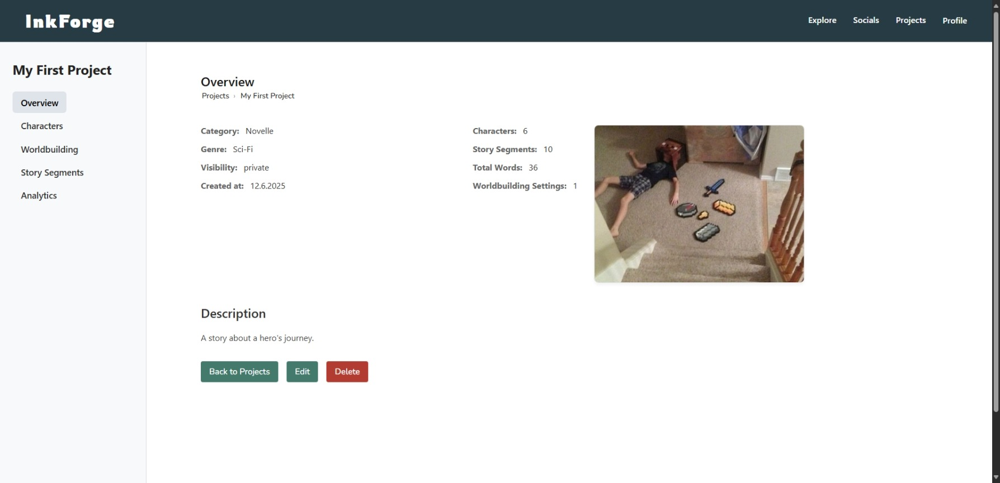

# InkForge

InkForge is a web-application for writers to organize and further plan their story ideas. Users can create projects and keep track of characters, story-settings, world-building, and plot points via story segments. Its aim is to act as a centralized Notes App that effectively categorizes and organizes original ideas, to aid the creative process.

### Features
- **Character Management:** Create and link characters to one another using relationship graphs.

- **Project Overview:** Organize writing projects by genre, geography, chapter structure, and more.

- **Interactive Graphs:** Visualize character relationships using Cytoscape with zoom, pan, and drag support.

- **Settings Module:** Modular CRUD system for world-building categories like geography, climate, and time period.

- **Story Segments:** Create, edit, and delete story segments to outline plot points.
- **User Authentication:** Secure login and registration system with password hashing.
- **File Uploads:** Upload and display images for projects, characters, and users.

### Tech Stack
- **Frontend:**	React.js
- **Backend:**	Node.js + Express
- **Database:**	MySQL (managed with phpMyAdmin)
  
Passwords are hashed with bcrypt.js, user authentication and authorization are handled by jsonwebtoken. Cross-Origin Resource Sharing (when hosting locally) is enabled by CORS. Picture Upload is done using Multer and UUIDs. For the relationship graph I am using Cytoscape. 

## Screenshots
### Exploring public projects

  

### Project Details

  

🔼Project Details of an unowned project

  

🔼Project Details of your own project

### Characters

  

  

### Worldbuilding

  

🔼Settings of an unowned Project

  

🔼Settings of your own Project

### Story Segments

  

🔼Segments of an unowned Project

  

🔼Segments of your own Project

### Relationship Graph

  

### Users

  

🔼User Page for regular Users

  

🔼Users Page with admin actions

### Projects

  

🔼Projects page with all created (and owned) projects
